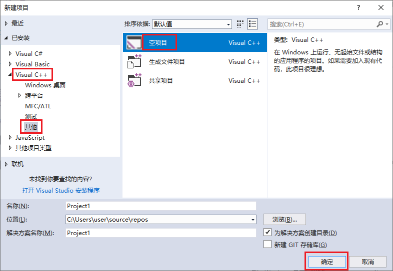
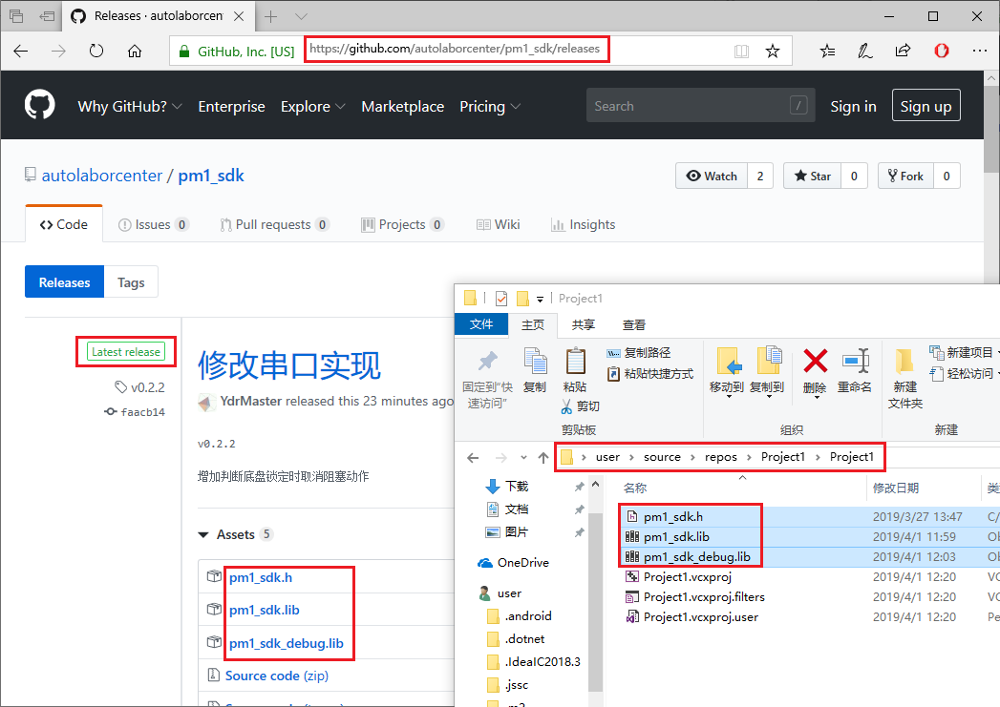
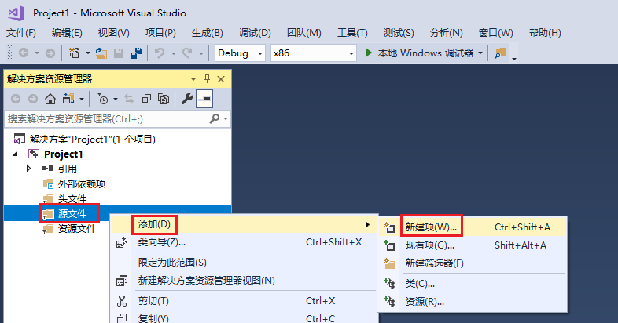
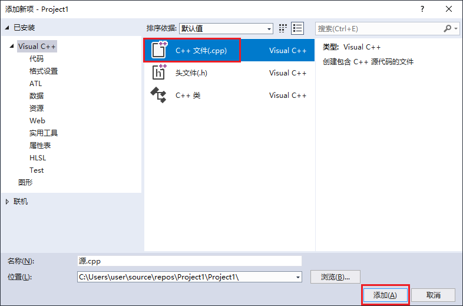
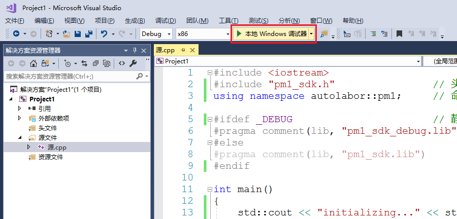

# 在 Visual Studio 中配置 PM1 SDK

1. 创建一个 C++ 空项目（以 VS2017 为例）

   打开 VS，依次点击菜单“文件”->“新建”->“项目”，弹出新建项目窗口。在新建项目窗口中选择 “Visual C++” -> “其他” -> “空项目” 创建项目，如下图所示。

   **注意！** 如果找不到此项目类型，请检查 VS 中是否已经安装 C++。

   

   

2. 下载 SDK 文件

   访问 PM1 SDK 的 [GitHub 发布页](https://github.com/autolaborcenter/pm1_sdk/releases)，下载最新版本的头文件（pm1_sdk.h）与静态库文件（pm1_sdk.lib、pm1_sdk_debug.lib），并将文件放置到项目路径下，按照上一步的项目名称位置，文件路径为 `C:\Users\user\source\repos\Project1\Project1`，如下图所示。

   

3. 添加测试代码并运行

   在解决方案资源管理器项目“源文件”项上右键“添加”->“新建项”，然后在弹出的添加新项窗口中选择 C++ 文件，添加一个源文件，如下图所示。

   

   

   然后在 `源.cpp` 中添加如下代码

   ```c++
   #include <iostream>
   #include "pm1_sdk.h"                 // 头文件
   using namespace autolabor::pm1;      // 命名空间

   #ifdef _DEBUG                        // 静态库
   #pragma comment(lib, "pm1_sdk_debug.lib")
   #else
   #pragma comment(lib, "pm1_sdk.lib")
   #endif

   int main()
   {
   	std::cout << "initializing..." << std::endl;
   	auto result = initialize();     // 初始化连接
   	if (result)
   	{
   	    std::cout << "connected to " << result.value << std::endl;
   	    unlock();                   // 解锁
   	    while (check_state() != chassis_state::unlocked)
   	    {
   	        delay(0.1);
   	    }
   	    std::cout << "moving..." << std::endl;
   	    turn_around(0.25, 1.57);    // 以0.25rad/s的速度原地转90°
   	    shutdown();                 // 断开连接
   	}
   	else
   	{
   	    std::cerr << result.error_info << std::endl;
   	}
   	system("pause");
   	return 0;
   }
   ```

   然后连接PM1点击运行测试代码

   
