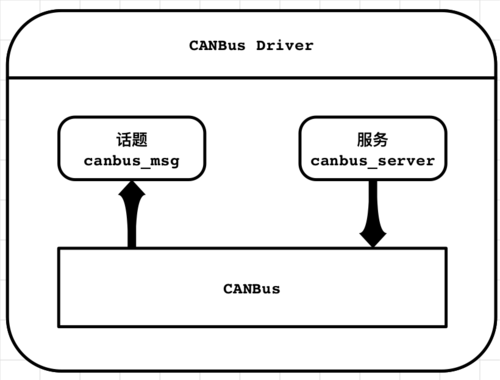
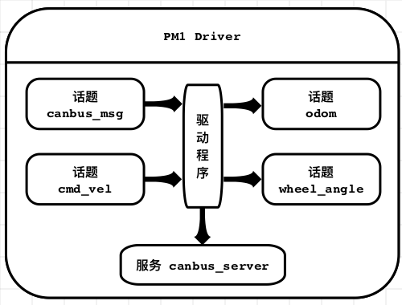

# Autolabor ROS 驱动模块

## 1. 介绍

Autolabor ROS 驱动模块包含 **CANBus 驱动**和 **Autolabor PM1 底盘驱动**，其主要功能包括与Autolabor_CANbus 模块通信，并通过线速度和角速度控制 Autolabor PM1 底盘行驶。

#### 特性

- 可直接获取 CANBus 网络内数据，并通过 CAN 指令控制车辆
  - 获取动力轮编码器原始数值
  - 获取转向轮编码器原始数值
  - 分别控制动力轮的转速
  - 控制转向轮的绝对转向角度
- 可通过线速度与角速度控制移动底盘，无需单独控制后轮转向
- 提供实时机器人底盘位置信息，方便闭环控制
- 双动力轮电子差速控制，保证机器人在行驶过程中始终满足阿克曼原理
- 根据后轮转向优化车辆运动速度，在保证车辆在行驶精度前提下，确保车辆行驶的流畅性

## 2. 节点

### 2.1 canbus_driver

该节点提供与底层 AutoCan 的通讯，将 CAN 网络中的数据进行解析并发布至 canbus_msg 话题中，并开启 canbus_server 服务，提供其他节点调用，用以发送 CAN 指令到 CAN 网络中。

该节点的结构如图所示：

#### 2.1.1 订阅话题

无

#### 2.1.2 发布话题

/canbus_msg  ([autolabor_canbus_driver/CanBusMessage](CanBusMessage))

> 将底层 CAN 网络中的数据发布在 ROS 话题中，提供其他节点读取

#### 2.1.3 服务

/canbus_server  ([autolabor_canbus_driver/CanBusService](CanBusService))

> 提供其他节点调用，用于往底层 CAN 网络中发布指令

#### 2.1.4 参数

~port_name  (str, default: /dev/ttyUSB0)

> CANBus 串口端口名

~baud_rate  (int, default: 115200)

> CANBus 串口波特率

~parse_rate  (int, default: 100)

> 数据解析器从串口获取新数据的频率

### 2.2 pm1_driver

此节点主要用于接收用户发送的速度信息，控制转向轮转动，并根据后轮当前角度结合阿克曼模型优化求解动力轮的转动速度，控制移动底盘进行移动，同时根据动力轮编码器的反馈，输出轮速里程计信息。

该节点结构如下：

#### 2.2.1 订阅话题
/cmd_vel ([geometry_msgs/Twist](http://docs.ros.org/api/geometry_msgs/html/msg/Twist.html))

> 外部节点发送的速度信息

/canbus_msg ([autolabor_canbus_driver/CanBusMessage](CanBusMessage))

> 由 canbus_driver 发送的底层 CANBus 消息，其中包含转向轮当前绝对编码器以及动力轮的编码器信息

#### 2.2.2 发布话题

/odom ([nav_msgs/Odometry](http://docs.ros.org/api/nav_msgs/html/msg/Odometry.html))

> 根据动力轮以及转向轮的编码器信息，依据车辆运动模型，计算出的轮速里程计信息

/wheel_angle ([std_msgs/Float64](http://docs.ros.org/api/std_msgs/html/msg/Float64.html))
> 转向轮实时绝对转角，单位 rad

#### 2.2.3 服务

/reset_odom ([std_srvs::Empty](http://docs.ros.org/api/std_srvs/html/srv/Empty.html))

> 里程计清零，将里程计的原点放置在执行指令的位置

#### 2.2.4 参数

~odom_frame (str, default: odom)

> 里程计坐标系名称

~base_frame (str, default: base_link)

> 移动底盘坐标系名称

~ecu_left_id (int, default: 0)

> 左侧动力单元的 CAN 节点编号（出厂已设置好，无需修改）

~ecu_right_id (int, default: 1)

> 右侧动力单元的 CAN 节点编号（出厂已设置好，无需修改）

~tcu_id (int, default: 0)

> 转向单元的 CAN 节点编号（出厂已设置好，无需修改）

~rate (int, default: 10)

> 速度控制以及里程计更新频率，单位 Hz

~reduction_ratio (double, default: 20.0)

> 动力单元编码器与车轮转速比例(和机械结构相关，无需修改)

~encoder_resolution (double, default: 1600.0)

> 动力单元编码器转动一圈产生的脉冲数(与编码器参数相关，无需修改)

~wheel_diameter (double, default: 0.211)

> 动力轮车轮直径，单位 m

~wheel_spacing (double, default: 0.412)

> 动力轮轮间距(两个动力轮中心之间的距离)，单位 m

~shaft_spacing (double, default: 0.324)

> 前后轮轴间距(转向轮中心到动力轮连线的距离)，单位 m

~max_speed (double, default: 2.0)

> 机器人底盘直线行驶最大速度，单位 m/s

~twist_timeout (double, default: 1.0)

> 速度控制超时时间，底盘的保护策略，最近一次的速度控制信息距当前时间超过这个时间，则强制移动底盘停止，单位 s

~optimize_limit (double, default: 0.785)

> 底盘行驶控制优化参数，用于设置底盘控制流畅程度，可设置范围为 [0, PI/2]，值越小表示执行越精确，但行驶流畅程度越低;值越大表示执行流畅程度越高，但精确度越低（如果没有特殊需求，一般保持默认值）

~smooth_coefficient (double, default: 0.1)

> 底盘行驶控制平滑参数，用于设置底盘速度变化平滑程度，可设置范围为 (0,1]，其中值越小表示速度变化越平缓；反之速度变化越剧烈。值为 1 时，表示对速度信息不进行平滑处理

~publish_tf (bool, default: true)

> 设置是否发布odom->base_link的TF转换

#### 

#### 2.2.5 TF转换信息

odom -> base_link

> 提供车体坐标系与里程计坐标系间转换关系
